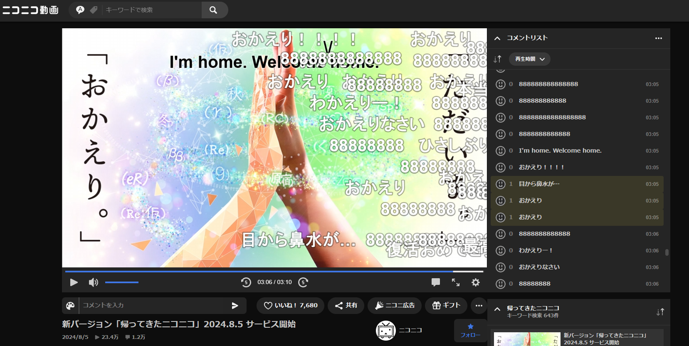

# nikodou-returnplayer_minor_fix_by_toarugema

ニコニコ動画のプレイヤーを個人的にちょっとだけ使いやすくします

# 何弄ったの？
・動画プレイヤーとコメント欄の角丸を無くしました

~~・コントローラーが常に表示されている際、コメント欄の長さを伸ばしました~~

~~(現在はコントローラー常時表示ではない状態でもコメント欄が伸びています。変更予定です。)~~

・コメント欄の長さをコントローラーが常に表示されている際の底辺まで伸ばしました。

CSSだけだと実装が難しい可能性が高いとのことなので、コメント欄を伸ばすことを優先しました。

不要な方はコメントアウトしてください。

・動画プレイヤーとコメント欄がある右サイドバーの間を無くしました

# このCSSを入れる弊害
右サイドバーの間を無くしているのでおすすめ動画とフォローボタンなどがくっついてます

（もしコメント欄だけくっつけて、おすすめ動画などは元の位置付近に戻してくれる改善をしてくださる方がいらっしゃれば弄ってください……）

プレイヤー本体の変更が入った際にプレイヤーがおかしくなる可能性があります。その際はこのCSSの使用を取りやめてください。
